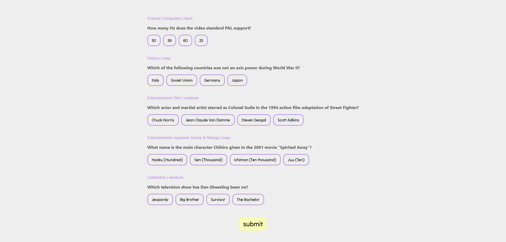

# Scrimba - Quizzical

This is a solution to the final lesson in [Scrimba's](https://scrimba.com) Learn React course. 

## Table of contents

- [Overview](#overview)
  - [The challenge](#the-challenge)
  - [Screenshot](#screenshot)
  - [Links](#links)
- [My process](#my-process)
  - [Built with](#built-with)
  - [What I learned](#what-i-learned)
  - [Continued development](#continued-development)
  - [Useful resources](#useful-resources)

## Overview

### The challenge

Users should be able to:

- Land on a welcome screen
- Move on to the quiz page
- Choose answers for 5 random quiz questions
- Have their answers graded when they click submit
- Be able to restart the quiz when 

### Screenshot

### Links

- Solution URL: [https://github.com/partum/quiz-game](https://github.com/partum/quiz-game)
- Live Site URL: [https://quiz-game-tawny.vercel.app/start](https://quiz-game-tawny.vercel.app/start)

## My process

### Built with

- CSS
- React

### What I learned

This is my most complex React project yet. This time I structured my files differently, and I think it made it a lot more manageable. I also learned a lot about when to put things in functions, when to pass info to components, and when to use hooks. Basic React stuff, I know, but it feels good to further solidify my knowledge.

### Continued development

This project has 2 pages, so I used React Router. I think in the future I want to learn how to work with Router better. Actually, this project was probably doable without Router.
I used a lot of conditional rendering. I think for a project this small, it was ok, but I think some areas could have been better handled with a different approach.

### Useful resources

- [Open Quiz DB API](https://opentdb.com/api_config.php) 
- [React Router Tutorial](https://www.geeksforgeeks.org/how-to-create-a-multi-page-website-using-react-js/) 
- [Find and replace characters in a string](https://stackoverflow.com/questions/9244824/how-to-remove-quot-from-my-json-in-javascript)
- [Example AIP call with error handling](https://linkpe.in/story/react-fetch-data)

